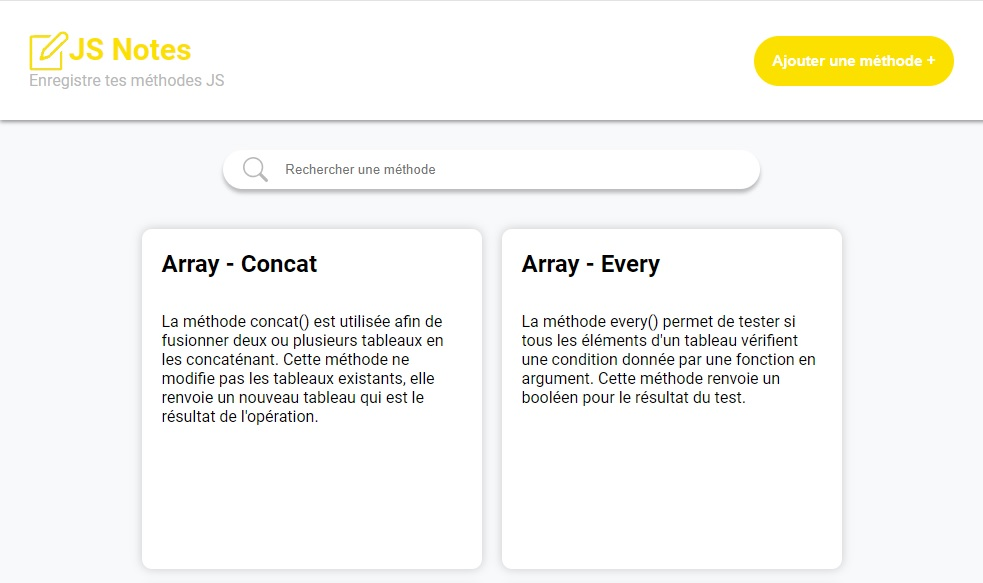

# JS Notes

JS Notes est une application où j'enregistre les méthodes disponibles en JavaScript afin de les consulter rapidement

### Objectifs

- Récupérer des méthodes dans un backend virtuel
- Stocker ces méthodes dans le store **Redux**
- Ajouter des méthodes
- Supprimer des méthodes
- Barre de recherche pour trier les méthodes
- Navigation entre plusieurs pages

### Maquette

### Instructions

- Réaliser le site avec **React** et **Redux**
- Un dossier par composant
- Chaque dossier devra contenir le JSX, le CSS et le JS, si besoin, du composant en question
- Utilisation de **SASS** pour le CSS

### Tester le projet

Pour tester le projet :

Cliquez ici ou :
- Cloner le github
- Ouvrir votre terminal et taper la commande suivante **npm i** afin d'installer les dépendances utilisées
- Taper **npm run server** pour lancer le serveur local
- Taper **npm run start** pour lancer le projet et le visualiser

Réalisé par [Carlos Leiroz](https://www.linkedin.com/in/carlos-leiroz/)
